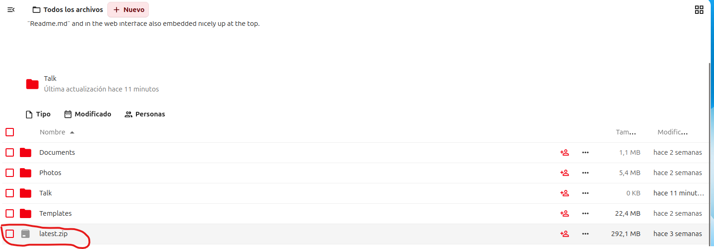
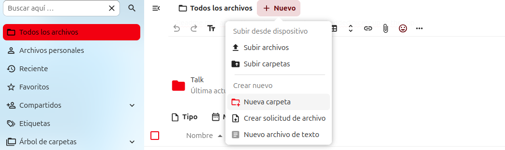
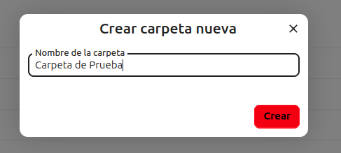
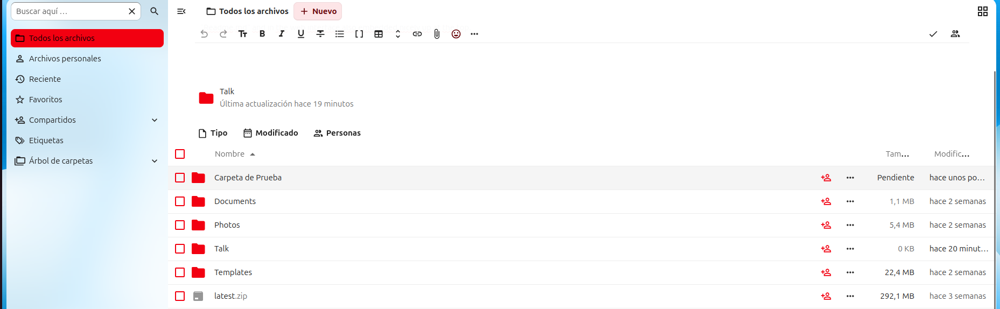
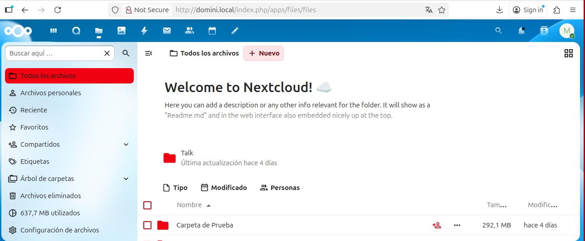
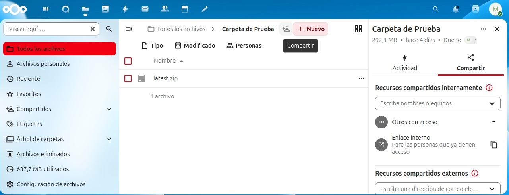

# Configuracion de NextCloud

## 1 Demostración del funcionamiento:

## Subir un archivo/Crear una carpeta/Compartir contenido:

### ***1.1 Para subir un fitchero:***

- ### ***Tienes que ir a "Todos los fitcheros", darle a "+ Nuevo":***

- ### ***I por último selecccionar el archivo que quieres subir i hacer doble click:***

- ### ***I ya lo tendras ahí:***

### ***1.2 Para crear una carpeta nueva:***

- ### ***Tienes que ir a "Todos los fitcheros" darle a "+ Nuevo" i por último darle a "Nueva Carpeta" :***

- ### ***Tendras que ponerle el nombre que quieras asignarle por ejemplo "Carpeta de Prueba":***

- ### ***I ya tendras la carpeta creada:***

### ***1.3 Para Compartir contenido:***
- ### ***Para compartir un contenido, tienes que darle al icono donde hay una persona i un simbolo de + de la carpeta o fitchero que quieres compartir:***

  
- ### ***Ahora simplemente tendras que rellenar la informacion, como poner el correo electronico i el nombre de a quien/es quieres enviarselo i compartirselo:***

